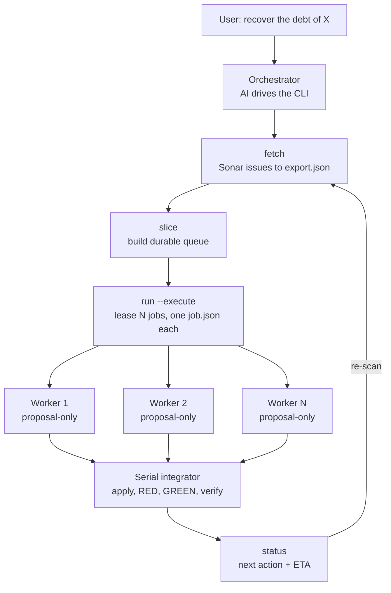

# SonarRemedy

Recover SonarQube technical debt automatically — a **proposal-only worker swarm with a serial integrator**, driven by any AI (VS Code Copilot, OpenCode, Claude Code) over MCP.

## Install

Python 3.11+ (stdlib only — no pip dependencies). Windows is the primary target.

**A. Install as a CLI (recommended):**

```powershell
git clone https://github.com/YeisonManco/SonarRemedy
cd SonarRemedy
python -m pip install -e .
```

> **Use the editable install (`-e`).** `sonarremedy update` auto-detects the clone
> via the editable install; a non-editable install moves the code to `site-packages`
> and `update` cannot find the clone anymore.

This installs three commands:

| Command | What it runs |
|---|---|
| `sonarremedy` | the facade CLI (`fetch`, `slice`, `run`, `status`, `init`, …) |
| `sonar-remedy-config` | the interactive config wizard |
| `sonar-remedy-mcp` | the MCP server for the editor |

**B. Run without installing** (skip `pip install`, call the module directly):

```powershell
python -B SonarRemedy/sonar_remedy.py --help
```

> **Important:** this installs the CLI for the **terminal only**. Copilot Chat in VS Code does **not** know about SonarRemedy until you run `sonarremedy init` in your project — see [Set up an editor](#set-up-an-editor-mcp). Install and editor setup are **two separate steps**.

## Update

Update the pack with one command — it works from anywhere (the clone is auto-detected):

```powershell
sonarremedy update
```

It runs `git pull` + `pip install` for you. If you need to point at a specific clone, use `sonarremedy update --path C:\path\to\SonarRemedy`. Check the version with `sonarremedy --version`.

## What it does

1. **Fetch** — pulls open issues, measures, and the quality gate from Sonar (chunked when the project exceeds the issue budget).
2. **Queue** — a durable SQLite queue groups findings by file+kind and leases bounded proposal contexts.
3. **Propose** — a proposal-only worker (a sub-agent or headless model) reads one bounded `job.json` and returns a strict `proposal.json`. Workers never touch the repo.
4. **Integrate** — a single serial integrator applies proposals, runs configured checks (RED/GREEN), and verifies byte-for-byte.
5. **Track** — `status`/`progress` report the next action, remaining jobs, and an ETA.

## How it works



**Concurrency model:**

- **One worktree per branch** — set up once by the orchestrator, never one per worker.
- Workers **propose in parallel** — each is isolated (no tools, no repo access) and reads only its own `job.json`.
- The integrator **applies serially** — one proposal at a time (RED → GREEN → byte-for-byte), even though proposals were prepared in parallel.
- **No commits/push in the pack** — the integrator edits the files; committing and pushing are separate human operations.
- Each **branch** gets its own queue + worktree + evidence; fixes never cross branches.

## Architecture

**Python does all the mechanical analysis; the AI does exactly one thing — propose the fix.**

| Layer | Modules | Role |
|---|---|---|
| Fetch | `sonar_fetch.py`, `sonar_client.py` | Pull Sonar issues (chunked if over budget) |
| Queue | `debt_queue.py` | Durable SQLite queue — claims, leases, fail-closed binding |
| Detect | `sonar_suppressions.py`, `sonar_exclusions.py`, `language_for`/`hint_for` | Find suppressions; detect language + distilled hints |
| Integrate | `debt_executor.py`, `debt_runner.py` | Apply proposals serially, run checks, verify byte-for-byte |
| Report | `status`/`progress`/`schedule` | Next action, ETA, parallel/serial plan |
| **AI (external)** | proposal worker | Reads one `job.json` → returns one `proposal.json` |

Everything that does not need AI is mechanical (zero tokens). The AI only proposes
what the mechanical tools cannot: understanding the code and writing an idiomatic fix.

## Commands

`sonarremedy <command> [flags]`

| Command | What it does |
|---|---|
| `fetch` | Pull Sonar issues into an export (chunked if over budget) |
| `slice` | Build a durable queue from an export |
| `run` | Lease/process a bounded manual proposal batch |
| `integrate` | Serially apply a recorded proposal + run bound checks |
| `autopilot` | Step one phase of fetch/slice/run/integrate automatically |
| `recover` | Loop the full cycle (fetch→slice→run→integrate→status) to the end |
| `configure` | Bind reviewed check commands + the target snapshot |
| `detect-checks` | Draft `--checks`/`--approve-checks-sha256` from the repo |
| `scan-suppressions` | Detect Sonar-evasion directives (`certain` vs `ambiguous`) |
| `scan-exclusions` | Detect Sonar exclusions/suppressions by language + category (17 rules) |
| `rules` | Manage the exclusion whitelist/blacklist (`list`/`allow`/`block`/`remove`) |
| `report` | List applied fixes + the human follow-up each requires |
| `document` | Regenerate the deterministic audit-trail `progress.json` + `report.json` |
| `status` | Report the queue's next action + ETA |
| `progress` | Write a human-readable progress file |
| `schedule` | Show the parallel/serial plan for pending jobs |
| `analyze` | Run the local pipeline to regenerate Sonar results |
| `run-all` | Fetch + slice every chunk into its own queue |
| `projects` | List saved project configs |
| `configure-project` | Save a project config non-interactively |
| `configure-projects` | Interactively register multiple projects |
| `init` | Wire up VS Code + Copilot, and create `.sonarremedy/` (idempotent) |
| `clean` | Remove generated state + sibling worktrees (keep `rules.json`) |
| `reset` | Remove `.sonarremedy/` entirely + sibling worktrees (back to zero) |
| `check` | Report whether the project's setup is up to date with the installed pack |
| `doctor` | Diagnose the setup + a queue's identity (root/branch/revision) with fixes |
| `update` | `git pull` + reinstall the pack from its clone |

## Diagnose

`doctor` reports what is wrong and how to fix it — use it before guessing:

```powershell
sonarremedy doctor                                 # project version + setup
sonarremedy doctor --state <queue> --repo <path>   # compare the queue's identity
sonarremedy doctor --fix                            # apply the safe repairs
```

- `--state` is the **queue directory** created by `slice` (it contains `queue.sqlite3`), not an export `.json` file.
- Each identity mismatch reports the **exact fix command**: `git -C <root> checkout <branch>` (branch), `run --repo <bound root>` (root), or re-fetch + re-slice (revision).
- `--fix` applies only the **safe repairs** — it re-runs `init` when the project's recorded version is behind the pack or init files are missing (and re-writes the pointer + version marker). It **never** touches a queue or the git state.
- `doctor` also reports a **`project`** check: which saved project binds to the checkout you passed (`ok` / `ambiguous` / `warning`). This is your "am I about to touch the right repo?" guard. A `warning` means no saved project matches this checkout; `ambiguous` means two configs match — pass `--project` to disambiguate.
- Project auto-detection: when you run a pipeline command (`fetch`/`slice`/`run`/`recover`/…) **without** `--project`/`--config`, the pack auto-selects the saved project that matches the actual target checkout — the explicit `--repo <path>` you passed (the documented way to run these commands: from the pack directory with `--repo` naming the real checkout), falling back to the current directory only when no `--repo` was given. No match falls back to the default config; an ambiguous match errors asking for `--project`.
- `doctor` also reports three more safety checks: `project_collisions` (two saved projects share a `local_path`/URL — give them distinct values), `remote_credentials` (the checkout's `origin` remote embeds a token — re-set it without the token and use a credential manager), and `queue_project` (the project registered for a `--state` queue in the `~/.sonar-remedy/queues.json` index). `slice --execute` and `recover` both record their queues automatically, whether the project is resolved from `--project`, from a matching `--repo`/checkout, or from a `--config` file whose own `repository` unambiguously matches a saved project.

> **One worktree per branch.** Slicing binds the queue to the checkout you passed. On a multi-worktree repo, always use the SAME `--repo` path across `fetch` → `slice` → `run`, or you will hit `target_identity_mismatch`.
>
> **Init per worktree.** A new worktree comes from `HEAD`, so it does NOT inherit the uncommitted `.github/` instructions, `.vscode/mcp.json`, or the gitignored `.sonarremedy/` setup — and you do NOT need to commit them. After `git worktree add`, run `sonarremedy init --dir <worktree>` (idempotent, merges your instructions) and verify with `sonarremedy doctor --dir <worktree>`; if files are missing, `doctor --fix --dir <worktree>` recreates them.

## Quick start

```powershell
# 1. Configure a project (Sonar URL, project key, token, repo, branch)
sonar-remedy-config --project <name> --persist

# 2. Fetch Sonar issues (chunked if over the budget)
sonarremedy --project <name> fetch --repo <path>

# 3. Slice the queue, run a batch, then resume
sonarremedy slice --export <export.json> --state <queue> --execute
sonarremedy run --state <queue> --execute --limit 8
# ... workers propose fixes ...
sonarremedy run --state <queue> --resume --execute
sonarremedy status --state <queue>
```

If you skipped the install, replace `sonarremedy` with `python -B SonarRemedy/sonar_remedy.py` and `sonar-remedy-config` with `python -B SonarRemedy/sonar_remedy_config.py`.

## Talk to the AI (after install + init)

Paste these in Copilot Chat, in order. Close Visual Studio before integrating (locked files fail the build gate).

### 1. Start — tell Copilot to run the whole recovery, don't improvise

> Recuperá la deuda técnica del proyecto `<name>` en la rama `<branch>` usando **SOLO los tools MCP de SonarRemedy** (`sonar_remedy_*`). No hagas trabajo manual, no leas el código fuente vos mismo, no improvises. Primero corré `sonar_remedy_doctor --repo <checkout>` y decime el estado. Después corré `sonar_remedy_recover` con el `checks.json` y su sha aprobado, `execute: true`. Seguí el loop hasta el final: fetch → slice → run → configure → integrate → re-scan. **No te detengas a preguntar** salvo que sea un bloqueo real (mirá la FAQ de troubleshooting); si algo falla, reportá el `reason` exacto y seguí.

### 2. Write proposals — when `recover` reaches `run` and asks for proposals

> Escribí una propuesta por cada job que te dé el tool, usando el contexto que te da (el método completo + la regla). Formato **exacto** del `proposal.json`: `{"version", "job_id", "attempt_id", "lease", "context_fingerprint", "status": "proposed", "edits": [{"path", "before_sha256", "replacements": [{"old", "new"}]}], "reason": "<token_sin_espacios>", "risks": [], "test_plan": "...", "follow_up": []}`. El `old` tiene que matchear **byte a byte** el archivo. Preservá comportamiento, BOM y newlines; no debilites tests, no agregues supresiones/exclusiones, no inventes prueba. Si un job necesita un refactor que cruza archivos, diferilo con `reason: "cross_file_refactor_required"`.

### 3. Keep going — when Copilot stalls or asks "what next?"

> Seguí con el loop, no te frenes. Si `recover` pide más propuestas, escribilas. Si un ciclo terminó (`re_scan_required`), el propio `recover` re-publica el análisis local y arranca el siguiente ciclo —no preguntes, seguí. Pará **solo** cuando devuelva `done` (0 issues) o `impossible` (todo terminal), o un bloqueo humano real.

### 4. Finish — report and hand off to commit

> Cuando termine, mostrame el resumen (cuántos `applied`/`locally_verified`, cuántos `deferred`/`failed` y por qué) y el diff de los cambios. Avisame cuando esté listo para commitear; yo reviso y commiteo/pusheo (el hook pre-push corre la suite antes del push).

Standing rules (also wired into the Copilot instructions by `init`): never do the work manually, never commit/push with `--no-verify`, and on any `blocked` report the exact reason and stop — a failed baseline build keeps the job `proposed` for retry, it never applies anything red.

## Deterministic flow (autopilot)

Copilot interprets instructions, so it can improvise. `autopilot` is the harness that owns the flow instead: every call advances as far as the rules allow — setup-gate, slice, run, configure-gate, integrate, status — and reports its phase with the exact next command. The model only fills bounded proposals; it never chooses a step.

```powershell
sonarremedy autopilot --state <queue> --repo <path>             # plan only (dry-run)
sonarremedy autopilot --state <queue> --repo <path> --export <export.json> --execute
# ... write one proposal per waiting proposal_path ...
sonarremedy autopilot --state <queue> --repo <path> --execute   # resume
sonarremedy autopilot --state <queue> --repo <path> --execute --integrate
```

- Dry-run is the default: it prints the ordered phases and writes nothing.
- A repo without `init` stops at the setup gate with the exact `init --dir` fix (no commit/push of instructions required — see the worktree note above).
- Proposals stop at `awaiting_proposals` with each `proposal_path`; integrating stops at the configure gate until checks are explicitly bound (`configure --checks ... --approve-checks-sha256 ... --execute`).
- The same flow is available to Copilot as the `sonar_remedy_autopilot` MCP tool.

### Loop to the end (`recover`)

`sonarremedy recover --state <base> --checks <file> --approve-checks-sha256 <sha> --execute` loops the cycle automatically: fetch → slice → run → configure → integrate → status, and on `re_scan_required` it re-analyzes (publishes to Sonar) and starts the next cycle. It stops only on 0 issues, no progress (everything terminal), or when the model must write proposals. The checks sha is approved once and reused.

### Coverage jobs (per file)

`fetch` now pulls per-file coverage from Sonar's component tree and turns each file with uncovered lines into a `coverage` job (`kind: "coverage"`, one per file, with `uncovered_lines`/`lines_to_cover`/`coverage`), so coverage is recoverable in measurable slices exactly like smells/security. Files at 100% are skipped; the lookup degrades gracefully (a token without coverage-tree access still fetches everything else, with a warning). The coverage hint (add a focused test for the uncovered lines) is already wired.

### Duplication jobs + gate thresholds

Duplication works the same way: `fetch` turns each duplicated file into a `duplication` job (`duplicated_lines`/`duplicated_blocks`/`duplicated_lines_density`). And `fetch` now reads the project's quality-gate conditions and reports them as `gate_conditions`, so the recovery TARGET is explicit (e.g. coverage ≥ 90, duplication < 5) instead of guessed.

### Fetch one category at a time

`sonar_remedy_fetch` accepts `kinds` (and `fetch` a `--kinds` flag) to pull only the sources you want — `smells`, `security`, `hotspots`, `coverage`, `duplication` — instead of everything at once. Ask for just coverage, just duplication, or just hotspots.

## Authoring checks.json (executor binding)

Integration runs **only** the check commands you explicitly bind — nothing else executes on the target. Write them from `examples/debt-checks.example.json` (a template: the sha256 placeholder must be replaced, never invented) following `docs/checks-reference.md`:

1. Real absolute `.exe` paths, real `cwd`, real failing-test markers; compute each sha256 with `python -B -c "import hashlib,sys; print(hashlib.sha256(open(sys.argv[1],'rb').read()).hexdigest())" <tool.exe>` (recompute after every tool update).
2. Dry-run first: `sonarremedy configure --state <queue> --repo <path> --checks <file>` — validates the shape and prints `checks_sha256` without writing.
3. Review it yourself, then approve: repeat with `--approve-checks-sha256 <digest> --execute`.

Don't hand-write it from scratch: `sonarremedy detect-checks --repo <path>` drafts it from the repo (solution, test projects, `dotnet` + real sha256) and tells you the 1–2 judgments to complete (same flow as `sonar_remedy_detect_checks`).

### Optional: TypeSafe pre-check

Set `TYPESAFE_API_KEY` and `integrate()` asks TypeSafe's System One a cheap yes/no question — does this proposal's diff plausibly address the Sonar rule it targets? — right before the expensive baseline build runs, and records the answer as evidence (`typesafe-precheck.json` in the job's `integration` folder). It is **opt-in and purely advisory**: with no key set (the default), nothing about `integrate()` changes at all, and even a network failure or a malformed response never blocks, gates, or alters integration — the worst case is an `error` status recorded instead of a score.

### Optional: TypeSafe exclusion/suppression triage

With the same env var set, `sonar_remedy_scan_exclusions` / `sonar_remedy_scan_suppressions` (`sonar_exclusions_report.scan()` / `sonar_suppressions.scan()`) also ask System One a cheap yes/no question per finding — does this NOSONAR/`@ts-ignore`/pragma-style directive look like a justified exception, or is it just silencing a real issue? — and attach the answer as an advisory `typesafe_legitimacy` field, so a human reviewing hundreds of findings can prioritize the least-justified-looking ones. It only scores each scan's most-severe still-open findings (pending exclusions, ambiguous suppressions), never an already-blocked/certain one, capped at 20 calls per scan regardless of findings count. Same contract as the pre-check: opt-in, purely advisory, **never auto-blocks or auto-allows an exclusion** — a human still decides, per `host-agents/sonarremedy-instructions.md` §9 — and with no key set nothing about either scan changes.

### Optional: TypeSafe hotspot risk triage

A `hotspots`-kind issue is always deferred for human review at intake (`debt_queue.plan()`) — it never reaches a worker, since `hint_for("hotspots")` is "do not auto-fix blindly." With `TYPESAFE_API_KEY` set, `plan()` also asks System One a cheap yes/no question per deferred hotspot job — does this pattern look like a genuine, exploitable risk, or a likely false positive / already-safe pattern? — and attaches the answer as an advisory `typesafe_hotspot_risk` field on the job record, visible to the human doing that review through `document()`'s `report.json`. Scoring is capped at 20 hotspot jobs per `plan()` call, and never touches `security`-kind jobs (even ones also deferred for human review) or any pending job. Same contract as the other two: opt-in, purely advisory, **never gates, blocks, or un-defers a job** — the existing defer-for-human-review decision stays exactly as it is — and with no key set nothing about `plan()` changes.

## Commit gate (pre-push hook)

`init` installs a pre-push hook into the project's `.git/hooks`, so broken code cannot be pushed: the hook runs the project's gates and blocks the push on red. Never use `--no-verify`.

- Pack repos: suite + `ruff check` + `ruff format --check` (mirrors CI).
- Managed projects: commands declared in `.sonarremedy-hooks.json` (`{"pre-push": [[...argv...]]}`); without it, the hook blocks with the exact shape to declare.
- `doctor` verifies the hook (`git_hooks`: ok/missing/foreign/outdated) and `--fix` reinstalls it. A foreign hook is never overwritten.
- `doctor --repo <path>` also detects an orphaned integration barrier (a killed integrate) and `--fix` releases it **only** when the tree matches the recorded pre-integration snapshot; real quarantines and mismatches stay blocked.
- Enforcement travels with the pack: hook + harness + instructions need no server settings. Optionally, on repos you own, add branch protection (GitHub → Settings → Branches → rule for `main`: require status checks) as a server-side backstop.

To save a project config non-interactively (for scripts), use:

```powershell
sonarremedy configure-project --name <name> --sonar-url <url> --project-key <key> `
  --repo-url <git-url> --local-path <path> --worktree-root <path>
```

The config stores the **name** of the token env var, never the value. Each project can use its own var, so multiple Sonar servers/accounts coexist:

```powershell
sonarremedy configure-project ... --token-env SONAR_TOKEN_PROJECT_B --pat-env GIT_PAT_PROJECT_B
```

## Set up an editor (MCP)

One command wires up VS Code + Copilot Chat:

```powershell
sonarremedy init --dir <your-project>
```

It writes:

- `.vscode/mcp.json` — the `sonar-remedy` MCP server (points at this pack).
- `.github/copilot-instructions.md` — the Copilot instruction.

Reload VS Code, then in Copilot Chat: *"recuperá la deuda de `<proyecto>`"*.

**Verify it's wired up** (optional): confirm the two files exist, then test the server in a terminal:

```powershell
'{"jsonrpc":"2.0","id":1,"method":"initialize","params":{}}' | sonar-remedy-mcp
```

It should reply with `"serverInfo":{"name":"sonar-remedy"...}`. In VS Code, the `sonar_remedy_*` tools then appear in Copilot Chat (you may need to reload the window: Ctrl+Shift+P → "Developer: Reload Window").

**Manual** (the same two files, by hand):

1. Copy `host-agents/vscode-mcp.json` to the project's `.vscode/mcp.json` (adjust the `args` path).
2. Copy `host-agents/copilot-instructions.md` to `.github/copilot-instructions.md`.

The MCP server exposes every command as a tool: `sonar_remedy_fetch`, `sonar_remedy_slice`, `sonar_remedy_run`, `sonar_remedy_status`, `sonar_remedy_progress`, `sonar_remedy_schedule`, `sonar_remedy_analyze`, `sonar_remedy_run_all`, `sonar_remedy_configure_project`, `sonar_remedy_scan_suppressions`, `sonar_remedy_scan_exclusions`, `sonar_remedy_rules`, `sonar_remedy_report`, …

## Safety boundaries

- Workers are **proposal-only** — no tools, no repo access. Only the serial integrator writes.
- Binding **fails closed**: wrong target/branch/revision blocks, never silent.
- Secrets (`SONAR_TOKEN`, `GIT_PAT`) live in the environment — never in files, args, or prompts.
- Mutations require `--execute`; dry-run is the default.
- `locally_verified` (tests passed) is not `sonar_confirmed` (Sonar no longer reports it); a fresh re-scan confirms.
- A **suppression scan** (`scan-suppressions`) flags directives that may evade Sonar (`NOSONAR`, `#pragma`, `# noqa`, …) as `certain` or `ambiguous` — only the `ambiguous` ones need AI judgment, so no tokens are spent on clear cases.
- An **exclusions scan** (`scan-exclusions`) reports Sonar exclusions/suppressions/coverage exclusions/technical exceptions by language + category, each with a severity (danger level). It is a **separate, optional** scan for "just the exclusions". Exclusions are **never auto-fixed** — a suppression may be legitimate, so a human reviews each one.

## Development

See `CONTRIBUTING.md` — TDD (RED/GREEN), Python stdlib only (no pip dependencies), and keep the MCP server in sync with the CLI. The full queue contract is in `docs/work-queue.md`.

Per-language fix skills live in `skills/` — `dotnet-index.md`, `python-index.md`, `angular-index.md`, `react-index.md`, plus the Sonar workflow skills under `skills/sonar/`. A worker fixes using both the kind hint and the language hint.

## Tests

```powershell
python -B -m unittest discover -s tests -v
```

## License

MIT — see `LICENSE`.
