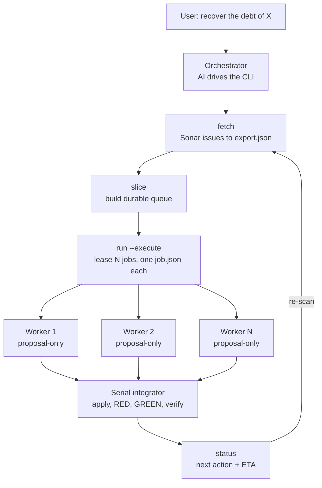

# SonarRemedy

Recover SonarQube technical debt automatically — a **proposal-only worker swarm with a serial integrator**, driven by any AI (VS Code Copilot, OpenCode, Claude Code) over MCP.

## Install

Python 3.11+ (stdlib only — no pip dependencies). Windows is the primary target.

**A. Install as a CLI (recommended):**

```powershell
git clone https://github.com/YeisonManco/SonarRemedy
cd SonarRemedy
python -m pip install .
```

This installs three commands:

| Command | What it runs |
|---|---|
| `sonarremedy` | the facade CLI (`fetch`, `slice`, `run`, `status`, `init`, …) |
| `sonar-remedy-config` | the interactive config wizard |
| `sonar-remedy-mcp` | the MCP server for the editor |

**B. Run without installing** (skip `pip install`, call the module directly):

```powershell
python -B SonarRemedy/sonar_remedy.py --help
```

**Development:** use an editable install so your edits take effect immediately:

```powershell
python -m pip install -e .
```

> **Important:** this installs the CLI for the **terminal only**. Copilot Chat in VS Code does **not** know about SonarRemedy until you run `sonarremedy init` in your project — see [Set up an editor](#set-up-an-editor-mcp). Install and editor setup are **two separate steps**.

## What it does

1. **Fetch** — pulls open issues, measures, and the quality gate from Sonar (chunked when the project exceeds the issue budget).
2. **Queue** — a durable SQLite queue groups findings by file+kind and leases bounded proposal contexts.
3. **Propose** — a proposal-only worker (a sub-agent or headless model) reads one bounded `job.json` and returns a strict `proposal.json`. Workers never touch the repo.
4. **Integrate** — a single serial integrator applies proposals, runs configured checks (RED/GREEN), and verifies byte-for-byte.
5. **Track** — `status`/`progress` report the next action, remaining jobs, and an ETA.

## How it works



**Concurrency model:**

- **One worktree per branch** — set up once by the orchestrator, never one per worker.
- Workers **propose in parallel** — each is isolated (no tools, no repo access) and reads only its own `job.json`.
- The integrator **applies serially** — one proposal at a time (RED → GREEN → byte-for-byte), even though proposals were prepared in parallel.
- **No commits/push in the pack** — the integrator edits the files; committing and pushing are separate human operations.
- Each **branch** gets its own queue + worktree + evidence; fixes never cross branches.

## Architecture

**Python does all the mechanical analysis; the AI does exactly one thing — propose the fix.**

| Layer | Modules | Role |
|---|---|---|
| Fetch | `sonar_fetch.py`, `sonar_client.py` | Pull Sonar issues (chunked if over budget) |
| Queue | `debt_queue.py` | Durable SQLite queue — claims, leases, fail-closed binding |
| Detect | `sonar_suppressions.py`, `sonar_exclusions.py`, `language_for`/`hint_for` | Find suppressions; detect language + distilled hints |
| Integrate | `debt_executor.py`, `debt_runner.py` | Apply proposals serially, run checks, verify byte-for-byte |
| Report | `status`/`progress`/`schedule` | Next action, ETA, parallel/serial plan |
| **AI (external)** | proposal worker | Reads one `job.json` → returns one `proposal.json` |

Everything that does not need AI is mechanical (zero tokens). The AI only proposes
what the mechanical tools cannot: understanding the code and writing an idiomatic fix.

## Commands

`sonarremedy <command> [flags]`

| Command | What it does |
|---|---|
| `fetch` | Pull Sonar issues into an export (chunked if over budget) |
| `slice` | Build a durable queue from an export |
| `run` | Lease/process a bounded manual proposal batch |
| `integrate` | Serially apply a recorded proposal + run bound checks |
| `configure` | Bind reviewed check commands + the target snapshot |
| `scan-suppressions` | Detect Sonar-evasion directives (`certain` vs `ambiguous`) |
| `report` | List applied fixes + the human follow-up each requires |
| `status` | Report the queue's next action + ETA |
| `progress` | Write a human-readable progress file |
| `schedule` | Show the parallel/serial plan for pending jobs |
| `analyze` | Run the local pipeline to regenerate Sonar results |
| `run-all` | Fetch + slice every chunk into its own queue |
| `projects` | List saved project configs |
| `configure-project` | Save a project config non-interactively |
| `init` | Wire up VS Code + Copilot (`.vscode/mcp.json` + instructions) |

## Quick start

```powershell
# 1. Configure a project (Sonar URL, project key, token, repo, branch)
sonar-remedy-config --project <name> --persist

# 2. Fetch Sonar issues (chunked if over the budget)
sonarremedy --project <name> fetch --repo <path>

# 3. Slice the queue, run a batch, then resume
sonarremedy slice --export <export.json> --state <queue> --execute
sonarremedy run --state <queue> --execute --limit 8
# ... workers propose fixes ...
sonarremedy run --state <queue> --resume --execute
sonarremedy status --state <queue>
```

If you skipped the install, replace `sonarremedy` with `python -B SonarRemedy/sonar_remedy.py` and `sonar-remedy-config` with `python -B SonarRemedy/sonar_remedy_config.py`.

To save a project config non-interactively (for scripts), use:

```powershell
sonarremedy configure-project --name <name> --sonar-url <url> --project-key <key> `
  --repo-url <git-url> --local-path <path> --worktree-root <path>
```

## Set up an editor (MCP)

One command wires up VS Code + Copilot Chat:

```powershell
sonarremedy init --dir <your-project>
```

It writes:

- `.vscode/mcp.json` — the `sonar-remedy` MCP server (points at this pack).
- `.github/copilot-instructions.md` — the Copilot instruction.

Reload VS Code, then in Copilot Chat: *"recuperá la deuda de `<proyecto>`"*.

**Verify it's wired up** (optional): confirm the two files exist, then test the server in a terminal:

```powershell
'{"jsonrpc":"2.0","id":1,"method":"initialize","params":{}}' | sonar-remedy-mcp
```

It should reply with `"serverInfo":{"name":"sonar-remedy"...}`. In VS Code, the `sonar_remedy_*` tools then appear in Copilot Chat (you may need to reload the window: Ctrl+Shift+P → "Developer: Reload Window").

**Manual** (the same two files, by hand):

1. Copy `host-agents/vscode-mcp.json` to the project's `.vscode/mcp.json` (adjust the `args` path).
2. Copy `host-agents/copilot-instructions.md` to `.github/copilot-instructions.md`.

The MCP server exposes every command as a tool: `sonar_remedy_fetch`, `sonar_remedy_slice`, `sonar_remedy_run`, `sonar_remedy_status`, `sonar_remedy_progress`, `sonar_remedy_schedule`, `sonar_remedy_analyze`, `sonar_remedy_run_all`, `sonar_remedy_configure_project`, `sonar_remedy_scan_suppressions`, …

## Safety boundaries

- Workers are **proposal-only** — no tools, no repo access. Only the serial integrator writes.
- Binding **fails closed**: wrong target/branch/revision blocks, never silent.
- Secrets (`SONAR_TOKEN`, `GIT_PAT`) live in the environment — never in files, args, or prompts.
- Mutations require `--execute`; dry-run is the default.
- `locally_verified` (tests passed) is not `sonar_confirmed` (Sonar no longer reports it); a fresh re-scan confirms.
- A **suppression scan** (`scan-suppressions`) flags directives that may evade Sonar (`NOSONAR`, `#pragma`, `# noqa`, …) as `certain` or `ambiguous` — only the `ambiguous` ones need AI judgment, so no tokens are spent on clear cases.

## Development

See `CONTRIBUTING.md` — TDD (RED/GREEN), Python stdlib only (no pip dependencies), and keep the MCP server in sync with the CLI. The full queue contract is in `docs/work-queue.md`.

Per-language fix skills live in `skills/` — `dotnet-index.md`, `python-index.md`, `angular-index.md`, `react-index.md`, plus the Sonar workflow skills under `skills/sonar/`. A worker fixes using both the kind hint and the language hint.

## Tests

```powershell
python -B -m unittest discover -s tests -v
```

## License

MIT — see `LICENSE`.
